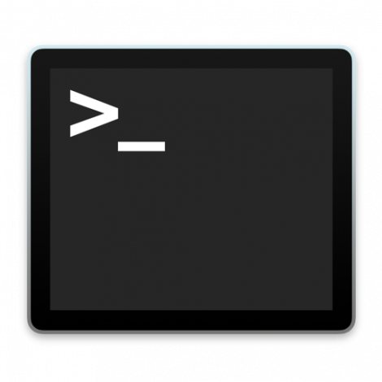

# CSCI 1103 Computer Science 1 Honors

### Fall 2022

Robert Muller - Boston College

------

## Setting Up Your System

In this course, we'll be developing code in a Unix environment on either MacOS or under Windows. The instructions in this document work for recent versions of MacOS and for Windows 11 **FIX THIS** or for Build 18362 or higher of Windows 10, Version 1903. If you have an older version of one of these operating systems, you'll need to upgrade your system before proceeding further with problem set 1. If you cannot upgrade for one reason or another, please get in touch with the instructor.

The coding environment that we're going to install has a lot of parts and the installation process involves many steps that have to be carried out carefully and exactly as specified. Some of the installation steps take a long time so set aside plenty of time for this work. If you run into problems with the installation process, please get in touch with a course staffer. Most of the installation steps will involve using a *command shell* to issue commands to the Unix operating system. Command shells may be new for you, but the Unix command shell is quite powerful and widely used so learning to work with it will be a good skill to develop in its own right.

### Work Flow

The basic flow of work for the course will be as follows. From time to time, you'll receive an email from GitHub Classroom with an invitation to accept a problem set. The email will look something like this:


When you accept the invitation, GitHub Classroom will make a private copy of the problem set for you in a *repository* on GitHub and provide you with a URL link to that repo.


So now you have your own *private* repository containing your copy of the problem set. Well, your repo is mostly private, it's shared only with the course staff. Your repo is hosted along with all of the others on our course GitHub site `https://github.com/BC-CSCI1103/`. If you visit that site, you'll see just a few repos, the ones that are privately owned by you and those that are public.

We'll come back to the discussion of the course workflow after we've set up the software on your computer.

## Setup for MacOS Monterey (12.0)

+ **If you're using a Windows system, skip this section -- scroll down to *Setup for Windows*.**
+ **If you're using a Mac running a much older version of MacOS such as MacOS Mojave (10.14), consider upgrading your operating system to Monterey, it's free in the App Store. **
+ **If you do upgrade your operating system, it's important that you complete that upgrade before following any of the steps below.**
+ **Respond affirmatively with a Y when queried by any installation step.**

---

### Setting up your Work Area

1. We're going to be using the MacOS **Terminal** application as our Unix command shell. We'll be using it often so it would be wise to copy the icon for the Terminal application

   

   to your taskbar. The Terminal icon can be found using the Finder. Select *Applications* (on the left) then scroll down and select *Utilities*, then scroll down to find Terminal. Drag the icon to the taskbar. Now fire up the terminal by selecting the icon. The window generated by the app is a Unix command shell. The command shell prompts the user for input. It will look something like 

   the `rm:~\>` part at the bottom is the bash prompt. In the bash commands that follow, we'll omit the prompt to simplify cutting and pasting.

   <details><summary>Type <tt>echo $SHELL</tt> then hit the <tt>return</tt> key. If you see <tt>/bin/bash</tt>, press on. If you don't see <tt>/bin/bash</tt> open this detail.</summary>

   Your Terminal app is probably configured to run the **zsh** shell instead of  the **bash** shell.  You'll need to make an adjustment to cause it to run bash instead. Open *System Preferences* under the apple (upper left), select *Users & Groups*. 

   Unlock the lock (lower left, requires password) then control-click on your entry and select *Advanced Options*. Use the dropdown menu to select */bin/bash*. Select *Ok* then re-lock the *Users & Groups* panel.

   </details>

2. Most operating systems use a tree-structured hierarchy of *directories* (aka *folders*) for organizing resources. Directories and files can be addressed using *file paths*, sequences of directory names separated by the `/` character. For example, the path `/usr/local/bin/` addresses one of the directories that Unix uses for executable programs (aka, *binaries*).

   If you want to see what's in a given directory you can use the *list* command `ls path`. For example, the command

   ```bash
   ls /usr/local/
   ```

   shows

   ```bash
   Frameworks/  bin/    include/  n/              share/
   Library/     etc/    lib/      opt/            texlive/
   algs4/       go/     libexec/  remotedesktop/  var/
   ```

   Each user is assigned a *home directory* where they can organize their files and subdirectories. My home directory is located via the path`/Users/muller`. When a user is interacting with the operating system via a command shell, In addition to a home directory, the user will also have a *working directory*. The working directory will often change as commands are issued in the shell. We can see the current working directory using the *print working directory* command `pwd`:
   ```bash
   pwd
   ```
   In a fresh shell, this will show something like `/Users/muller` confirming that the working directory is initially set to the home directory. The *change directory* command `cd`,  when typed with just these two letters, will reset your working directory to the home directory.

   The *make directory* command `mkdir` makes a new directory in the current working directory. Let's make a work area for the materials developed in this class. We'll informally refer to this new directory as the *course home directory*.

   ```bash
   cd
   mkdir csci1103
   ```

   Done in this way, you can always navigate to our course home directory by typing

   ```bash
   cd
   cd csci1103
   ```

   Or equivalently in one line:

   ```bash
   cd ~/csci1103
   ```

   The tilde character `~` designates the path to your home directory.

### Setting up the OCaml Ecosystem

1. Install [MacPorts](https://www.macports.org/install.php), a utility for managing software packages on macOS.

   > Heads up! Do you already use another package manager such as Homebrew? If so, be aware that some of our course software doesn't work when supporting software has been installed with Homebrew. For the purposes of this course, please use MacPorts.

   After installing MacPorts, quit the Terminal app and fire it up again.

2. Use the newly installed MacPorts package manager to install OCaml's package manager [opam](https://opam.ocaml.org/), a graphics support library `lablgtk2` and a handy CLI utility called `tree`.

   > Heads up! 
   >
   > + MacPorts is invoked from the Unix command line as `port`. The `port` command writes files to privilege protected directories on your computer so it has to be run under the unix `sudo` command which prompts for a password. 
   > + Note that in the process of installing these programs, you may be asked to install the *XCode Command Line Utilities*. We'll need these tools so install them as directed.

   ```bash
   sudo port install opam lablgtk2 tree
   sudo port select --set python python310
   ```

3. Initialize `opam`. It's probably best to copy and paste the following two-command sequence -- the two quotation marks in the second command are backquotes (upper left, below the esc key). This command will not work if you type the normal single-quote marks.

   ```bash
   opam init
   eval `opam config env`
   ```

4. The installation script for OCaml's package manager `opam`, also installs the other main parts of the OCaml system. Fire up the OCaml interpreter to confirm that it's working.

5. 
   ```bash
   ocaml
   ```

   You should see something like:

   ```ocaml
   OCaml version 4.12
   #
   ```
   It's fine if you have OCaml 4.14 instead. You can type in expressions as you like, ending them with two consecutive semi-colons `;;`. Type `Ctrl-d` (i.e., hold down the `Control` key and while still holding it, type the `d` key) to exit the REPL.

6. Now use the Unix `git` command to retrieve some setup tools from our course site on GitHub.

   ```bash
   git clone https://github.com/BC-CSCI1103/setup.git   
   ```

7. Install various OCaml packages. This is taken care of for you in a `configure` script. Type exactly or cut and paste:

   ```bash
   cd ~/csci1103/setup
   ./configure
   ```

7. Install the [XQuartz](https://www.xquartz.org/) X-Window server.

8. Reboot your computer.

9. Test your OCaml setup. Type or cut and paste:

```bash
cd ~/csci1103/setup/test/stopNgo/src
dune exec bin/main.exe
```
<details><summary>If you see a simple animation, try hitting the touchpad a few times to start and stop. If you don't see the animation, open this detail.</summary>

   Something is wrong. Try copying and pasting the following two lines into the command shell:
   > ```bash
   > echo "eval $(opam env)" >> ~/.bash_profile
   > source ~/.bash_profile
   > ```
   >
   > Now try the `dune exec` command again. If it still doesn't work, contact a course staffer.

</details>

### Setting up your Editor

The last step in the MacOS-specific installation process is to set up your code editor. You're welcome to use any text/code editor that you like. In this course, we're using [vscode](https://code.visualstudio.com/) as the default editor. It's now one of the industry standards and is well adapted to developing code in OCaml. 

+ In previous semesters, we've encouraged students to use GitHub's [Atom](https://atom.io/) editor. But if you like it, you can certainly use it for this course, instructions for installing and configuring atom are below. **NB the Atom editor will be discontinued as of December 15, 2022. **
+ As you'll see, your instructor sometimes use the ancient and arcane but still-fantastic [emacs](https://www.gnu.org/software/emacs/) text editor. If you're feeling adventurous, give it a try! It's easy to install: `sudo port install emacs`.

#### Setting up vscode

1. Install the [vscode editor](https://code.visualstudio.com/download).

2. Like other modern editors, vscode can be customized in various ways. In vscode parlance, these customizations come packaged up in [Extensions](https://marketplace.visualstudio.com/vscode). Use the Visual Studio Marketplace to search for and install the [OCaml Platform Extension](https://marketplace.visualstudio.com/items?itemName=ocamllabs.ocaml-platform).

   

   > The OCaml Platform Extension depends on the `ocaml-lsp-server` opam package. This was installed for you earlier in the `configure` step.

3. Fire up the vscode editor. This can be done either through the GUI by clicking on the vscode icon

   

   or better yet, by using the unix command shell. Type

   ```bash
   source ~/.bash_profile
   cd ~/csci1103/setup/test/stopNgo/src/
   code .
   ```

   > If this doesn't work, get in touch with course staff.

   Once vscode is running, you should see something like below. The red arrow is pointing to a blocky icon denoting vscode's Extension manager. Select it.

   

   OCaml Platform has been installed on your computer, now you'll need to search for it and install it into vscode.

   Now close the Extension Manager by toggling its blocky icon (left), then open the file Explorer, its icon is top left. Also X-out the Get Started pane. You should see something like

   You'll find your working OCaml source files by opening the `bin` directory (red arrow) and you can fire up a unix Terminal from within vscode by selecting the circled X at bottom left (yellow arrow). Stowing away the Explorer by toggling its icon should leave you with something like this:
   
   Try typing that `dune exec` line to confirm that all is working. If you see this behavior, congrats you're good to go! Scroll down past the atom and Windows setup sections to **Finishing up the Workflow** below.

#### Setting up atom

> Heads up: Atom is being discontinued, vscode is the recommended editor for this course.

1. **Install** Download and install the [Atom editor, v 1.60.0](https://atom.io/). Following the instructions here will leave you with a very serviceable Atom-based coding environment. Many CS students at BC use Atom for all of their CS courses at BC.

   **After you've installed Atom, use the Finder to open your Applications folder to ensure that Atom has been installed there. You should see the Atom icon**

   ****

   **If you don't see the Atom icon in your Applications folder, drag it there.** Also consider dragging the icon to your task bar.  Now fire up Atom by double-clicking the icon, then, under the **Atom** menu item, select **Install Shell Commands**. Exit Atom.

2. **Configure** Atom is an "extensible" editor. This means that it has processes in place for people to write and install *packages* of code that tailor the editor for particular applications. Executing the following command will install a number of packages that tailor Atom for OCaml. Type
   ```bash
   which apm
   ```

   <details><summary>This should return something like <tt>/usr/local/bin/apm</tt>.  If it doesn't, open this item.</summary>

   If you didn't see <tt>/usr/local/bin/apm</tt>, it means that Atom didn't install the `apm` and `atom` shell commands for you. You may have failed to move Atom to the `Applications` folder. If so, try again. Then open Atom then under the *Atom* menu item select <b>Install Shell Commands</b>. Then exit Atom.
   </details>

   Now type

   ```bash
   cd ~/csci1103/setup
   ./configureAtom
   ```
3. **Test** Now we can test whether or not your editor settings are working. Move to the testing area and fire up the Atom editor from the unix command shell by typing:

   ```bash
   cd ~/csci1103/setup/test/
   atom .
   ```

   You should see Atom's welcome page with three or four tabs, `Project`, `Welcome` and `Welcome Guide`. (There may also be one related to "Telemetry".)   

   Dismiss all but the `Project` tab by X-ing them out (upper right). Now open the `hello` directory, then `src` then `bin` then select `main.ml`. You should see this

   
   The tab labeled `main.ml` is displaying OCaml code. This code can be executed by using OCaml's *build manager* `dune`. In the Unix command shell, type
   ```bash
   cd ~/csci1103/setup/test/hello/src
   dune exec bin/main.exe
   ```
   > Heads up! The bit on the last line must say `bin/main.exe` even though the `bin` folder has a file named `main.ml`.

   Introduce an error in this code by deleting the quotation mark at the end of line 8. You should see

   

   the red dot on line 8 indicates that the OCaml editor support packages have found a problem with your code. Generally speaking, you'll want to make sure that your Atom editor window is free of these errors (i.e., no red dots!). If you restore the quotation mark the red dot will disappear.

   If you don't see this behavior, contact a course staffer. If you do, great! You're alll done! Scroll down to **Finishing up the Workflow** below.

---

## Setup for Windows 

# STOP HERE, WAITING TO UPGRADE Windows SO WE CAN USE WSL2; NEED Windows 11 or Windows 10, Version 1903, Build 18362 or later


> + **These Instructions are cribbed in part from Cornell's CS3110 Spring 2020**
> + **These instructions presume that you are running Windows 10. If you are running an earlier version of Windows, these instructions won't work.**
> + These instructions are rather lengthy and detailed. It's important to follow them carefully. Contact a course staffer if you run into problems.

The basic idea is to make use of the Windows Subsystem for Linux (WSL) and Microsoft's vscode editor. Our setup has 5 parts:

1. Enable Windows Subsystem for Linux (WSL) and Install Ubuntu
2. Set up your Work Area
3. Set up the Basic OCaml Ecosystem
4. Add Support for Graphical Applications
5. Install and Configure the vscode Editor

### 1. Enable Windows Subsystem for Linux (WSL) and Install Ubuntu

[Here is an (optional) introduction](https://github.com/michaeltreat/Windows-Subsystem-For-Linux-Setup-Guide/blob/master/readmes/01_preface.md) to what WSL is and why you need it.

**Don’t skip step 1:** *a number of problems have resulted from laptops having older versions of Windows 10*.

1. **Check your Windows Build** Run the `winver` program by selecting *Start* then typing "winver" (then hit Enter). A dialog box will open. Look on the second line for “OS Build XXXXX.YYY”. If the XXXXX part of that is a number smaller than 17643, you're going to need to update Windows. If so, go to *Settings* → *Update & Security* → *Windows Update* → *Check for updates* and install updates. When finished, run `winver` again to confirm that the build is now 17643 or greater. If you can’t get a recent build, your hardware might be a bit older, get in touch with the instructor.

2. **Record your Windows Username** Select *Start* and then type "cmd". A Windows cmd shell will open. The prompt should be of the form`C:\Users\username>` where `username` is your Windows username. Write this down or remember it, we'll need it later. Close the cmd shell.

3. **Enable WSL** Open Windows PowerShell as Administrator. To do that, select *Start*, type "PowerShell" then right-click on *Windows PowerShell* (it should be at the top as the best match), and select *Run as administrator*. Select *Yes* to allow changes. At the prompt (which is probably something like `PS C:\windows\system32>`), enter the following command.

   > If you're careful you can type in all of the commands in this Setup guide but cutting and pasting is generally more reliable.
   ```bash
   Enable-WindowsOptionalFeature -Online -FeatureName Microsoft-Windows-Subsystem-Linux
   ```
   If you're prompted to restart, do so. Otherwise, close PowerShell.

4. **Install Ubuntu 20.4** Select *Start*, type "Microsoft Store", and open the *Microsoft Store* app. Click *Search*, and type "Ubuntu". Scroll down to Apps, and choose **Ubuntu 20.04 LTS**. From the Ubuntu page. Select *Get*. After the download finishes, click *Launch*. The install will then finish.

   > You may want to pin the Ubuntu app to your Windows *Start* menu. You can do this by right-clicking on the Ubuntu icon.

   You'll be prompted to create a UNIX username and password. You can use any username and password you wish. It has no bearing on your Windows username and password (though you are free to re-use those).

   > Heads up! You'll need to remember your Unix username and password for future use.

   You're now interacting with the Unix operating systems using a terminal application running the Bash shell. The prompt will look something like
   ```bash
   user@machine:~$
   ```

   You’ll want to make sure copy-and-paste into the terminal is enabled: Click on the icon on the top left of the shell window, select *Properties*, and make sure the checkbox for *Use Ctrl+Shift+C/V as Copy/Paste* is checked. Now **Ctrl+Shift+C** will copy and **Ctrl+Shift+V** will paste into the terminal.

   > + Heads up! You have to include **Shift** as part of that keystroke.
   >
   > + If you don’t see the *Use Ctrl+Shift+C/V as Copy/Paste* option, your Windows build is too old. Make sure you updated Windows to a new enough build, as described above. Right-click might still work to paste even if you don’t have a new enough build.

5. **Update Ubuntu** [About 4 mintes] Software is generally deployed in *packages* and most systems have tools for managing packages. One of the more widely used package managers in the Unix environment is the *advanced packaging tool* `apt`. Enter the following command into the shell:
   ```bash
   sudo apt update
   ```
   You'll be prompted for the UNIX password you chose earlier. The command `apt update` updates the list of packages managed by `apt` on your system. The prefix `sudo` tells Unix to run the  `apt udate` command as the *system administrator*, aka *super user*.

   > Heads up!  Running Unix commands with `sudo` is potentially dangerous and should't be done lightly. Do not get into the habit of putting `sudo` in front of commands.

   Now run the `apt upgrade` command to actually upgrade all the `apt` software packages; this took about 3 minutes on my system. If you're prompted about configuring libssl, just hit Enter to accept the default choices.
   ```bash
   sudo apt ungrade -y
   ```
6. **Install a few other Unix Packages** [About 7 minutes] Several of the OCaml tools that we'll be using rely on lower-level operating system tools and packages. Install these as follows. Generally speaking, you should respond affirmatively when prompted.
   ```bash
   sudo apt install m4 pkg-config libcairo2-dev libgnomecanvas2-dev tree unzip
   ```

   At this point, you can run a “bare-bones” Ubuntu Unix terminal as an application within your WSL system. It's worth noting that as of this writing, WSL doesn't install any support for graphics of any kind including the graphical user interfaces (GUIs) that you're accustomed to.

### 2. Set up your Work Area

WSL has its own file system that is distinct from the Windows file system. You can edit Windows files from WSL, but you cannot edit WSL files from Windows. For more information about the differences between the Windows and WSL filesystems, and how to work with them, see [this guide](https://github.com/michaeltreat/Windows-Subsystem-For-Linux-Setup-Guide/blob/master/readmes/03_understanding_the_file_systems.md).

Most operating systems use a tree-structured hierarchy of *directories* (aka *folders*) for organizing resources. Each user is assigned a *home directory* where they can organize their files and subdirectories. When a user is interacting with the operating system via a command shell, in addition to a home directory, the user will also have a *current working directory*. The home directory is fixed but it's common for the current working directory to change as we interact with the shell. In the Ubuntu shell, type the *print working directory* command `pwd`

```bash
pwd
```

This will display a string called a *file path* which specifies the sequence of directories leading to the current working directory. For me, it shows the file path  `/home/muller`. This indicates that my Unix home directory is `muller` and the path to that home directory is `/home/muller/`.

> Pro tip: The tilde character `~` can be used as an abbreviation of the path to your home directory.

My Windows home directory is elsewhere, back to that in a minute.

One can make a subdirectory of the current working directory using the *make directory* command `mkdir`. Let's make a directory to hold the materials in this course, type

```bash
mkdir csci1103
```

We'll call this the *course home directory*. One can see what files and directories are contained within a directory using the *list* command `ls`. Typing

```bash
ls
```

will show that the directory `/home/muller` now contains one item, the subdirectory `csci1103`. The current working directory can be changed via the *change directory* command `cd`. Typing

```bash
cd csci1103
```

> Pro tip: Instead of typing out all of the letters in `csci1103`, you can just type the first letter `c` and then hit the `tab` key and the command shell will finish it for you. A great time saver.

Now use the `pwd` command to confirm that the current working directory is `/home/muller/csci1103`. To be clear, the *home directory* is still `/home/muller`. If we want to "return" to our home directory, all 4 of these options will do it:

```bash
1. cd /home/muller
2. cd ~        # remember that ~ is an abbreviation for the file path /home/muller
3. cd
4. cd ..       # means set the current working directory to the parent directory, 
               # i.e., move up one level
```

Note that you can always move to the home directory for this course by typing `cd ~/csci1103`.

You can access your Windows home directory from WSL Linux via the path `/mnt/c/Users/YOUR_WINDOWS_NAME/` where `YOUR_WINDOWS_NAME` is your Windows username. It's convenient to make a link for it, so you could access it quickly, for instance, calling it `windows`. This is how to create such a link:

 ```bash
cd
ln -s /mnt/c/Users/YOUR_WINDOWS_NAME/ windows    # NOTE THE SPACE!
 ```

Now you can navigate to your Windows home directory from your Ubuntu command shell by typing `cd ~/windows` and to your course home directory by typing `cd ~/csci1103`.
### 3. Set up the Basic OCaml Ecosystem

The OCaml ecosystem has 3 major parts:

1. A suite of compilers and interpreters implementing the OCaml programming language;
2. A *package manager* called [opam](https://opam.ocaml.org/); this manages libraries of OCaml code.
3. A *build manager* called [dune](https://dune.build/); this manages the compilation, linking and execution of OCaml code.

2. Install the OCaml package manager `opam`. [About 4 Minutes]

   ```bash
   sudo add-apt-repository ppa:avsm/ppa
   sudo apt-get update
   sudo apt install opam
   ```

   > Some of the above may indicate errors, but I found that ignoring the errors and completing the last line worked out.

3. Initialize the `opam` package manager:

   ```bash
   opam init --disable-sandboxing
   ```

   > **Heads up! The two quote marks in the `eval` command below are *backquotes* (upper left, below the `esc` key).**

   ```bash
   eval `opam config env`
   ```

   Exit the Ubuntu shell and restart Ubuntu.

4. Installing and initializing opam also installs the OCaml compiler `ocamlc` and the OCaml interpreter `ocaml`. Fire up the interpreter by typing its name

   ```bash
   ocaml
   ```

   You should see something like this

   

   > It's fine if you see OCaml version 4.8

   Type in an arithmetic expression or two, each followed by two consecutive semicolons `;;`. Type `ctrl-d` to exit the interpreter.

4. Now we'll retrieve some configuration tools from the course GitHub site.

   ```bash
   cd ~/csci1103
   git clone https://github.com/BC-CSCI1103/setup.git
   ```

   > Pro tip: Typing the `ls` command will show you that you now have a directory called `setup`, but if you want to see what the directory contains, try the newly installed `tree` command. You should see something like
   >
   > 

5. **Configure** [About 7 Minutes] Execute the course `configure` script to install several OCaml packages: `dune`, `merlin`, `animate`, etc. Type `Y` to accept the installation.

   ```bash
   cd ~/csci1103/setup
   ./configure
   ```

6. Now test the basic installation. Use the `dune` build manager to compile and run the sample `hello` program as follows:

7. ```bash
   cd ~/csci1103/setup/test/hello/src
   dune exec bin/main.exe
   ```

   If you see *"Hello World!"*, great! Press on. If you don't, something is amiss, contact a course staffer.

### 4. Add Support for Graphical Programs

The configuration developed so far is fine for running OCaml programs on WSL. But WSL doesn't provide support for graphical applications. In order to run graphical applications under WSL, we'll need to install a windowing system. We'll use the tried and true X-Windows system, aka *X11*,  (which isn't related to Microsoft Windows). In order to use it, we'll have to complete 2 steps:

1. Install *server* software for X-Windows, a so-called X-server;
2. Configure our Unix command shell (i.e., bash) to tell graphical applications to use the newly installed X-server.

#### Install the VcXsrv X-server

There are many X-servers out there, for this course we'll use [VcXsrv](https://sourceforge.net/projects/vcxsrv/). Download and install it (using your Windows browser). The VcXsrv server includes a window launcher utility called *XLaunch*. Find the XLaunch shortcut on the Desktop or in the Start Menu, and click it. You'll be greeted by a simple setup wizard. Accept the default options on the first two pages (i.e., *Multiple windows* then *Start no client*). **On page 3, select the *Disable access control* check box.**


You can always start the X-server by double-clicking its icon. If you don't want the hassle, on page 4 of the setup wizard, select the ***Save configuration*** button. This will display a Save configuration page that will allow you to save the choices you just made in a configuration file called `config.xlaunch`. Save it in the default choice `Documents`. Now use the Unix `cd` and *move* command `mv` to move the `config.xlaunch` file to the Windows Startup area as follows:

```bash
cd ~/windows
mv Documents/configure.xlaunch AppData/Roaming/Microsoft/Windows/Start\ Menu/Programs/Startup/
```

Having saved your `config.xlaunch` file in the `Startup` directory as shown, the X-server will start automatically for you on system startup and you won't have to hassle with starting it by hand anymore. Once the X-server is launched, an X icon will appear in your system tray. If you want to run a graphical application and you don't see the X icon in the starter tray, you can start the X-server by hand by double-clicking the XLaunch icon.

#### Configure the Command Shell to use the X-server

In an Ubuntu command shell, carefully type or cut and paste the following:

```bash
cd
echo "export DISPLAY=localhost:0.0" >> .bash_profile
echo "eval $(opam env)" >> .bash_profile
source .bash_profile
```

These commands insert two command lines into your `.bash_profile` file in your Unix home directory. The commands in the `.bash_profile` file are executed every time you start up an Ubuntu command shell.

#### Test a Graphical Application

OK, are we good to go? Let's try a graphical application. Type

```bash
cd ~/csci1103/setup/test/stopNgo/src
```

Now use the `dune` build manager to build and run the `stopNGo` program:

```bash
dune exec bin/main.exe
```

If you have trouble with any of the above steps, get in touch with course staff.

### 5. Install and Configure the vscode Editor

You made it this far, great job! The last step is to install Microsoft's **vscode** editor. Once this is setup, we'll be running vscode from an Ubuntu shell by typing the command

```bash
code .
```

meaning, fire up vscode and have it open the current working directory. This will start vscode from the command line, assuming that the `code` command is defined on Ubuntu's `PATH` environment variable. But there is a bit of a hitch in running vscode in this way. On installation, vscode has a checkbox offering to set the `PATH` variable. But in practice, it doesn't always set this variable as advertised. To correct this problem, we've provided a bash script called `patchVSCode`, we'll describe when and how to use it.

Fire up a browser in Windows and [install vscode for Windows](https://code.visualstudio.com/download). At the end of the installation, the installer offers to start vscode. Uncheck that box. If you miss this step and the installer starts vscode, exit vscode. In an Ubuntu shell type

```bash
cd ~/csci1103/setup
git pull
./patchVSCode YOUR_WINDOWS_USERNAME
```

Exit Ubuntu and restart it. Now type

```bash
which code
```

This should return the path to the vscode program `/mnt/c/Users/.../Programs/Microsoft VS Code/bin`. If so, you're all set. Now fire up vscode in WSL.

```bash
cd ~/csci1103/setup/test/hello/src
code .
```

We're now going to install several *Extensions* that customize vscode to work well with OCaml (Extensions are known as *Packages* in Atom). You can search for Extensions in vscode by selecting the blocky icon on the left.


Typing `@installed` in the search box at the top left lists all of the already-installed Extensions.

When you fire up vscode, it will notice that you have enabled WSL so it will recommend that you install the **Remote - WSL** Extension. Install the following Extensions:

1. Remote - WSL (from Microsoft, v 0.44.4 or better)
2. Remote Development (from Microsoft, v 0.20.0 or better)
3. OCaml and Reason IDE (from Darin Morrison, v 1.038 or better)
4. Live Share (from Microsoft, v 1.02731 or better)

Select the **Ocaml and Reason IDE** Extension, it should have a green button for **installing it on WSL**. It's important that you select that button. Navigate to the file `/bin/main.ml`. You should see something like


Note the annotations `OCaml` and `merlin` on the right in the blue bar on the bottom.

Merlin is the wizard of errors. (!) If you introduce an error, say, by deleting the quotation mark at the end of line 8, you should see an orange squiggle below and a small red highlight bar on the right, as in


This is an indication that merlin has detected a mistake. If you restore the correct code by reintroducing the quotation mark, the error annotations should disappear.

---

So no we have the development process:

1. Open a command shell in Ubuntu;

2. Use the Unix `cd` command to navigate to the `src` directory of the project that you're working on;

   ```bash
   cd ~/csci1103/ps1-dogfishbar/src             # for example
   ```

3. fire up `vscode` from WSL by issuing the Unix command

   ```bash
   code .
   ```

4. Write your OCaml code;

5. When your code seems worth testing (i.e., merlin isn't flagging errors) and you think it might be reasonable, use `dune` to build and run it:

   ```bash
   dune exec bin/main.exe
   ```

6. If it works, great! For submission instructions, read on. If your code doesn't work, return the the editor...

---

## Finishing up the Workflow

Back to the problem set. Whether you're using Windows or MacOS, you can make a local *clone* of your problem set repository on your laptop. Fire up your web browser and visit the course website `https://github.com/BC-CSCI1103/` and scroll down to your repo for pset 1 (mine would be called `ps1-dogfishbar`). Select the green **Clone or download** button.


Copy the web URL of the repo to your clipboard. Then, fire up a Unix command shell and make a local clone of the repo by typing the `git clone` command:

```bash
cd ~/csci1103
git clone https://github.com/BC-CSCI1103/ps-demo-dogfishbar.git
```

Of course, rather than `ps-demo-dogfishbar.git`, the rightmost bit for you will have something like `ps1-smith.git` rather than `ps-demo-dogfishbar.git`. The `git clone` command  will cause the `git` and `GitHub` systems to make a local copy of your remote (master) repo. The repo for ps1 has four items:

1. a writeup in the form of this `README.md` file,
2. a hidden `.gitignore` file,
3. an `img/` folder containing the images shown above, and
4. a `src/` folder for code. A `src/` folder will usually have a `dune-project` file and a `bin` directory. The `bin` directory will typically have OCaml "harness" code — code that isn't finished.

The distributed source code should always compile and run. Type

```bash
cd ~/csci1103/ps1-YOUR_GITHUB_ID/src/
dune exec bin/main.exe
```

The unix `dune` command builds (i.e., compiles and links) executable code. All of the projects for this course will be distributed with working `dune` files.

### Wrapping Up

To review, you'll use the [atom](https://atom.io/) or [vscode](https://code.visualstudio.com/) text editor to develop your problem set solutions and you'll use `dune` to compile and test your work. As you work on your code, you should use Unix's `git` commands `git add` and `git commit` to commit your work to your local git repository periodically.

When your code is working (and looks great!) you can submit it for grading using `git push` to transfer your local working repository to your master problem set repository on the Github course website.

```bash
cd ~/csci1103/ps1-YOUR_GITHUB_ID/
... edit ... git add ... git commit ...
git push
```

After reviewing your work, course staff will leave comments and record your problem set score in the local BC [gradebook on Canvas](https://bostoncollege.instructure.com/courses/1614229/).
